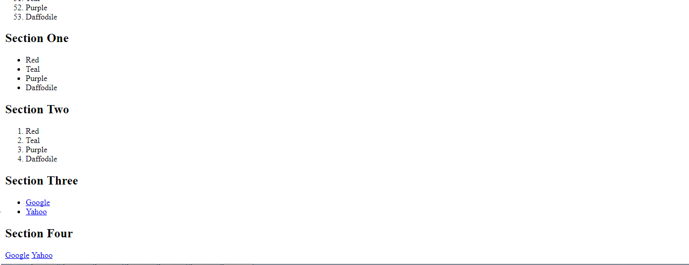

title: HTML
subtitle: The Structure of the Internet
theme: league

# What is HTML?

HTML (Hypertext Markup Language) is the first of three languages we use to create the front-end (also known as the client-side) of the web. Each of the three languages that we use (HTML, CSS, and JavaScript) have a specific job to do and it is important to keep these concerns separate. HTML's job is to structure and organize your content.

## Standard HTML Document

- HTML is marked up with tags. There are common tags that you will see in each HTML document. Lets open Visual Studio and create a blank html document.

- Let's put what we learned to the test. I need a volunteer!!

    <div float="right" class="img"></div>

	- Open Visual Studio

	- Select File > New > Project

!SLIDE

   <div float="right" class="img"></div>

- Select <mark>Installed</mark>.

- Select <mark>Web</mark>.

- Select <mark>Web Site</mark>

- Ensure <mark>ASP.NET Empty Web Site</mark> is highlighted.

- Select the <mark>Web Location Path</mark>.

- Use your right arrow key to navigate to the end of the location path.

- Change <mark>WebSite1</mark> to <mark>MySuperDopeWebSite</mark>. 

- Your location address might have a value different than <mark>WebSite1</mark>, not to worry just replace whatever value is there to <mark>MySuperDopeWebSite</mark>

- Finally Select <mark>Ok</mark>.

## Lets add an HTML page

   <div float="right" class="img"></div>

   - Place your cursor in the Solution Explorer and right click on <mark>SuperDopeWebSite</mark>

   - Select <mark>Add</mark> then <mark>Add New Item</mark>.

!SLIDE

   <div float="right" class="img"></div>

- Ensure <mark>Visual C#</mark> is selected under templates.

- Ensure <mark>HTML Page</mark> is highlighted.

- Change the value in the <mark>Name</mark> field to <mark>index.html</mark> 

- Finally select <mark>Add</mark>

## We should all be here!!

   <div float="right" class="img"></div>

## It's all about the Tags

```html
<!DOCTYPE html>
<html lang="en">
<head>
    <meta charset="UTF-8">
    <meta name="viewport" content="width=device-width, initial-scale=1.0">

    <title>Document</title>
</head>
<body>

</body>
</html>
```
- Our html page is built using <mark>Tags</mark>.

- The Tags we will discuss in our index.html page are as follows:

	- <mark><!DOCTYPE html> <html> <head> <body></mark>

- You'll notice these each have a closing tag (i.e. `</body>`). Let's look at these in more detail.

## DOCTYPE

<pre><code class="language-html" data-noescape>
<mark>&lt;!DOCTYPE html&gt;</mark>
&lt;html lang="en"&gt;
&lt;head&gt;
    &lt;meta charset="UTF-8"&gt;
    &lt;meta
        name="viewport"
        content="width=device-width, initial-scale=1.0"&gt;

    &lt;title&gt;Document&lt;/title&gt;
&lt;/head&gt;
&lt;body&gt;

&lt;/body&gt;
&lt;/html&gt;
</code></pre>

- The DOCTYPE tag tells your browser that this document is HTML. With that declaration, your browser knows to interpret this as HTML and display it as such.

## HTML Tag

<pre><code class="language-html" data-noescape>
&lt;!DOCTYPE html&gt;
<mark>&lt;html lang="en"&gt;</mark>
&lt;head&gt;
    &lt;meta charset="UTF-8"&gt;
    &lt;meta
        name="viewport"
        content="width=device-width, initial-scale=1.0"&gt;

    &lt;title&gt;Document&lt;/title&gt;
&lt;/head&gt;
&lt;body&gt;

&lt;/body&gt;
<mark>&lt;/html&gt;</mark>
</code></pre>

- The `<html>` tag houses all of your other tags. All of your content needs to be inside of them.

## Head Tag

<pre><code class="language-html" data-noescape>
&lt;!DOCTYPE html&gt;
&lt;html lang="en"&gt;
<mark>&lt;head&gt;</mark>
    &lt;meta charset="UTF-8"&gt;
    &lt;meta
        name="viewport"
        content="width=device-width, initial-scale=1.0"&gt;

    &lt;title&gt;Document&lt;/title&gt;
<mark>&lt;/head&gt;</mark>
&lt;body&gt;

&lt;/body&gt;
&lt;/html&gt;
</code></pre>

- The `<head>` tag houses metadata for each of your pages. This content gives information to your browser about the page and content on the page. This is also where CSS and JS files can be attached to your page.

## Body Tag

<pre><code class="language-html" data-noescape>
&lt;!DOCTYPE html&gt;
&lt;html lang="en"&gt;
&lt;head&gt;
    &lt;meta charset="UTF-8"&gt;
    &lt;meta
        name="viewport"
        content="width=device-width, initial-scale=1.0"&gt;

    &lt;title&gt;Document&lt;/title&gt;
&lt;/head&gt;
<mark>&lt;body&gt;</mark>

<mark>&lt;/body&gt;</mark>
&lt;/html&gt;
</code></pre>

- The `<body>` tag houses all of the content that your user will see/interact with.

# Box Model

## Let's Build Our Super Dope Website

- Copy and paste the following in between the  <mark>body</mark> tags of your <mark>index.html</mark> page.

```C#
My Super Dope Web Page Hi, this is my super awesome fun web page where the content makes no sense but there is a lot of it. 
So let's get into some business that you can learn from. This is a list of colors that are colorful in no particular order: 
Red Teal Purple Daffodil Lime Green Magenta Atomic Tangerine This is a list of movies ranked from most-awesome to not-as-awesome 
Anything with Bill Murray in it Life Aquatic Jurassic World Blade II The Matrix Sequels Let's look at some images: Cats Are Awesome! 
Look at this one: Doggos Are Pretty Cool Too This doggo is a tricky doggo: Sometimes people say important things You need to document 
important things that people say so you can sound smart when it's necessary. Success is a lousy teacher. It seduces smart people into 
thinking they can't lose. - Bill Gates When it comes to HTML, there are some things you just shouldn't do At least, not anymore... 
Want bold text? There's a wrong way and a right way. Always use the right way! Maybe you need some italics? Again, it used to be done 
like this. This is wrong. This is the right way. Separation of concerns The wrong way tags above are deprecated and should not be used. 
HTML should be used to mark-up or organize your content. It should not be used to style your content or interact with it. Those are 
the jobs of CSS and JavaScript! Links Links are one of the most important parts of the web. They help you navigate from place to place 
on the internet. Sections Section elements are good for grouping elements that belong together. You can also use div's for this

```

## Elements in HTML

- HTML tags and the content they house are called elements. 

- Lets add some HTML <mark>elements</mark> to our page.

- Let's start with the <mark>h1</mark> tag. This is a <mark>header</mark> tag.

- Go ahead and type these header in between the <mark>body</mark> tags in your index.html page.

- You will see the <mark>number 1</mark>. This signifies the size of the header

- `<h1>My Super Dope Web Page</h1>`
- `<h2>My Super Dope Web Page</h2>`
- `<h3>My Super Dope Web Page</h3>`

- Lets publish our web page by selecting <mark>Google Chrome</mark> on the Visual Studio standard toolbar.

- Your Chrome browser will open, and your index page will be displayed.

## We should all be here

   <div float="right" class="img"></div>

   - Question time: What do you notice about the size of the font in relation to the header tags?

## Paragraph tags

- Next is the <mark>p</mark> tag.

- These are <mark>paragraph</mark> tags.

- Go ahead and type these paragraphs after you last header tag in your index.html page.

- `<p>Hi, this is my super awesome fun web page where the content makes no sense but there is a lot of it.</p>`
- `<p>So let's get into some business that you can learn from.</p>`

- Select <mark> Ctrl Shift f5</mark> to restart your browser.

## We should all be here

   <div float="right" class="img"></div>

   - Question time: Is there a difference between the line spacing between our paragraphs on our browser and our Visual Studio page?

## Ordered and unordered lists

- Next are the unordered list <mark>ul</mark>, ordered list <mark>ol</mark> and list <mark>li</mark>tags.

- Go ahead and type these lists after your last paragraph tag in your index.html page. Select <mark> CTL Shift f5</mark> to restart your browser.

```HTML
<ul>
	<li>Red</li>
	<li>Teal</li>
	<li>Purple</li>
	<li>Daffodile</li>
</ul>
```
```HTML
<ol>
	<li>Red</li>
	<li>Teal</li>
	<li>Purple</li>
	<li>Daffodile</li>
</ol>
```
```HTML
<ol start = "50">
	<li>Red</li>
	<li>Teal</li>
	<li>Purple</li>
	<li>Daffodile</li>
</ol>
```
## We should all be here

   <div float="right" class="img"></div>

   - Question time: What is the difference between an ordered and unordered list?

   - Question time: What does the <mark>start</mark> attribute do in the second ordered list?

## Sections

- Next is the <mark>section</mark>tag.

- Go ahead and type these lists after your last order list tag in your index.html page.

- Select <mark> CTL Shift f5</mark> to restart your browser.

```HTML
<section>
	<h1>Section One</h1>
	<ul>
		<li>Red</li>
		<li>Teal</li>
		<li>Purple</li>
		<li>Daffodile</li>
	</ul>
</section>
```
```HTML
<section>
	<h1>Section Two</h1>
	<ol>
		<li>Red</li>
		<li>Teal</li>
		<li>Purple</li>
		<li>Daffodile</li>
	</ol>
</section>
```
## We should all be here

   <div float="right" class="img"></div>

   - We can use section to divide our elements, and provide a mechanism to make changes to individual sections.

   
## HyperLinks

- Next is the <mark>a</mark>tag or hyperlink tag.

- Go ahead and type these lists with hyperlinks after your last section tag in your index.html page.

- Select <mark> CTL Shift f5</mark> to restart your browser.

```HTML
<section>
	<h1>Section Three</h1>
	<ul>
		<li><a href="http://www.google.com">Google</a></li>
		<li><a href="http://www.yahoo.com">Yahoo</a></li>
	</ul>
</section>
```
```HTML
<section>
	<h1>Section Four</h1>
	<a href="http://www.google.com">Google</a>
	<a href="http://www.yahoo.com">Yahoo</a>
</section>
```
## We should all be here

   <div float="right" class="img"></div>

   - Notice the hyperlink is located within the opening <mark>a</mark> tag, and the name of the link is in between the <mark>a</mark> tags.

   - Question time: Could I have assigned any name we wanted to each hyperlink?
   
## Images

- Next is the <mark>img</mark> tag.

- Go ahead and type these lists with hyperlinks after your last section tag containing the two hyperlinks in your index.html page.

- Select <mark> CTL Shift f5</mark> to restart your browser.

```HTML
<section>
	<h1>Section Five</h1>
	<ul>
		<li></li>
	</ul>
</section>
```
```HTML
<section>
	<h1>Section Six</h1>
	
</section>
```
## Tiles

- Next is the <mark>title</mark> tag.

- Go ahead and type this line of code in between the <mark>head</mark> tag in your index.html page.

- Select <mark> CTL Shift f5</mark> to restart your browser.

```HTML
<title>SuperDope</mark>
```
- Question time: What changes on our web page?

## Element Attributes

- There are attributes that you can include on your elements that will affect the way they behave. Some attributes are required to make an element function. These include:

- href (hypertext reference) - Used to give anchor tags a location to link to
- type - Used usually on input elements to describe what type of input they should accept
- src (source) - Used in script tags and img tags. These house the location of the resource

# DIV and SPAN tags

## Divs

- Div tags are a useful tool in HTML. A `<div></div>` tag is a generic block level element. 

- They are used mostly for organizational purposes in HTML code. 

- If you have a block of information that exists as a group, you may choose to group it in a div to keep it organized and identify it as one unit:

- Go ahead and type the following code after your last section tag containing the last image in your index.html page.

- Select <mark> CTL Shift f5</mark> to restart your browser.

- Question time: What does this remind you of in our earlier code?

```html
<div>
    <h2>Wonder Woman</h2>
    <h3>Super Hero</h3>
    <p>10/13/2017</p>
</div>
```

## Spans

- Similar to divs, spans are a generic element in html as well. 

- The difference being that they are generic inline level elements. 

- Span tags are used mostly to add emphasis or apply specific CSS styles.

- These can be used for highlighting individual text in a paragraph or list item.

- Go ahead and type the following code after your last div tag in your index.html page.

- Select <mark> CTL Shift f5</mark> to restart your browser.

```html
<p>I enjoy driving my <span style = "color:red;font-weight:bold" >Ford Bronco</span> but I really enjoy riding my <span style = "color:black;font-weight:bold; font-style:italic" >Road King</span>.</p>
```

# IDs and Classes

## IDs

- IDs in HTML are used as unique identifiers for your individual elements. 

- You can apply an ID to specific elements but, no two elements should have the same identifier. 

- You can think of them as similar to the key value in a Dictionary.

- ID's are identified by a <mark>#</mark> in front of the element identifier.

- Let's go back to our first <mark>h1</mark> element, and add the following

```html
<h1 id="page-title">My Super Dope Web Page</h1>
```
!SLIDE

- Go ahead and type the following code after your last p tag in your index.html page.

```html
<a href="#page-title">Go back to where 'My Super Dope Web Page' is located on the page.</a>
```
- You will notice the <mark>href</mark> attribute is referencing the <mark>page-title id</mark>. You know its an id because of the <mark>#</mark> in front of the id.

- You will find id's helpful when selecting specific elements in CSS and JS. 

- You can also use them for their specific location in a page. 

- For example, if you give an anchor tag an existing ID as a value, when you click the link, it will take you to the location of the element with that ID on the page.

- Select <mark> CTL Shift f5</mark> to restart your browser and click on the link at the bottom of your index.html page.

## Classes

- Classes in HTML are similar to IDs. 

- They identify an element in your code. 

- The difference between IDs and classes is that classes are not unique. 

- You may give multiple elements the same class and you can give one element multiple classes. 

- Make the following changes to your div and span elements

- Unlike id's which are referenced by <mark>#</mark>, classes are referenced by <mark>.</mark> or a period before the class name.'

```HTML
<div class="superhero">
        <h2>Wonder Woman</h2>
        <h3>Super Hero</h3>
        <p>10/13/2017</p>
</div>
```
```HTML
<p class="superhero">I enjoy driving my <span style="color:red;font-weight:bold">Ford Bronco</span> but I really enjoy riding my <span style="color:black;font-weight:bold; font-style:italic">Road King</span>.</p>
````
- The benefits of using classes and id's will be clearer when we get into CSS and Javascript.


## Boxes

- Each HTML element in the body has a structure that looks like this:


- At the center is the content inside of your element. (i.e. `<p>This is the content</p>`).

- Just outside of that we have the padding. Padding adds space between your content and the inside of your element.

- The next layer is the border. The border outlines your element. Borders don't have a value by default.

- The final layer is the margin. The margin is similar to padding but this creates space outside of your element.

- Goto your browser and select the <mark>f12</mark>. Lets practice accessing the box.Visual Studio.

# Display Values

## Inline vs. Block

There are two basic display values, inline and block. All HTML elements have one of these values by default.

Block level elements can be thought of like building blocks. These elements will have the width of your viewport and will stack one on top of the other based on where they are in the code.

Inline elements will only take up as much space as their content requires. Think paragraphs, anchors, or spans.

<style type="text/css">
.img:hover  {
        transform: scale(1.5);
        box-shadow: 0 0 10px rgba(0, 0, 0, 0.5);
    }
</style>


